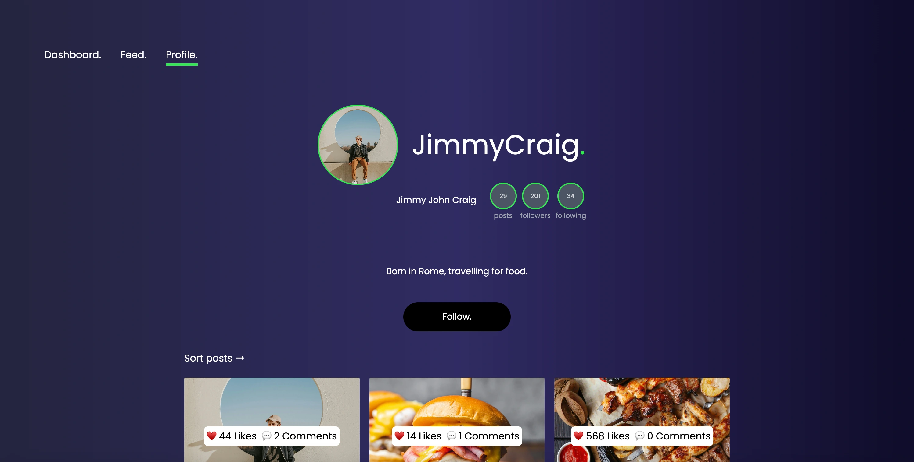

# 🍕 Foodiegram



**A social media application.**

## Description

Foodiegram is a social media app for "foodies", gathering food lovers from around the world to a social meeting arena, where the users can share their experiences and recommendations, recipes and tips.

## 🚀 Features

- **Feed & Posts** – View and create posts.
- **User Authentication** – Create an account and log in securely. _(COMING)_
- **Profile Management** – Update your profile and see your list of posts. _(COMING)_
- **DM's and messaging** – Send and receive messages between users. _(COMING)_

## 🛠 Built With

- **Tailwind CSS** – styles
- **HTML & CSS** – structure and custom styles
- **JavaScript** – client-side logic
- **Node.js & Express.js** – backend routing

## Getting Started

### 1. Installation

#### Clone the repository:

```bash
git clone git@github.com:telecasteren/foodiegram.git
cd foodiegram
```

**Install the dependencies:**

This will install:

- Express.js (backend server)
- Tailwind CSS (frontend styles)
- Live Server (static frontend preview)
- Other required dependencies

If you haven’t installed Node.js, go to:<br/>
[node.js](https://nodejs.org/en)<br/>
and download the latest version.

To verify installation and version, run:

```

node -v
npm -v

```

**Install concurrently**

This will make it possible to run multiple commands _concurrently_<br/>
[Read about concurrently here](https://www.npmjs.com/package/concurrently)<br/>
In this project it is being used in this line inside the package.json file:

```bash
"dev": "concurrently \"npm run tailwind\" \"node server.js\"",
```

**Install it locally like this:**

```bash
npm i -D concurrently
```

### 2. Run the app

To start both the backend server and Tailwind, run:

```bash
npm run dev
```

You will see this in the console outcome:</br>
_Server is running on http://localhost:5500_

Now, open it in your preferred browser and get to testing!

**Alternatively, run only the frontend**

If you only want to work with the design/styling and don’t need backend features like login/signup:

Run this:

```bash
npm run frontend
```

This will launch a local development server for the frontend (public/ folder) using Live Server (already installed with the project dependencies).

In another terminal window, start Tailwind:

```bash
npm run tailwind
```

**Why only Tailwind?**

If you just want to make styling/design changes without needing backend functionality, this method is faster and simpler.
However, for the full experience, I recommend running the full app with concurrently.

## ⭐ Contributing

**Right now I'm not looking for contributors, as this is a school project.**</br>
When contributing becomes available, see guidelines and more about it here:
[CONTRIBUTING.md](docs/CONTRIBUTING.md).

## 👨🏼‍💻 Contact me

Portfolio [telecasteren.github.io](https://telecasteren.github.io/)

Github [@telecasteren](https://github.com/telecasteren)

LinkedIn [Tele Caster Nilsen](www.linkedin.com/in/tele-caster-nilsen-7002b9249)

## License

Under no licence p.t.

## 🫶 Acknowledgments

- ChatGPT for text content in some of the titles and post captions.

### Under a free licence on Unsplash, images by the creators:

#### **AVATAR IMAGES**

- [rayul @ Unsplash](https://unsplash.com/@rayul)
- [ayo-ogunseinde @ Unsplash](https://unsplash.com/@armedshutter)
- [ian-dooley @ Unsplash](https://unsplash.com/@iandooley)
- [toa-heftiba @ Unsplash](https://unsplash.com/@heftiba)
- [ivana-cajina @ Unsplash](https://unsplash.com/@von_co)
- [rafaella-mendes-diniz @ Unsplash](https://unsplash.com/@rafaellamendesdiniz)

#### **POST IMAGES**

- [rayul @ Unsplash](https://unsplash.com/@rayul)
- [chad-montano @ Unsplash](https://unsplash.com/@briewilly)
- [casey-lee @ Unsplash](https://unsplash.com/@caseylee)
- [brooke-lark @ Unsplash](https://unsplash.com/@brookelark)
- [anh-nguyen @ Unsplash](https://unsplash.com/@nguyentuananh)
- [adam-jaime @ Unsplash](https://unsplash.com/@adamjaime)
- [joseph-gonzalez @ Unsplash](https://unsplash.com/@gonzalez)
- [victoria-shes @ Unsplash](https://unsplash.com/@sheshoots)
- [adam-jaime @ Unsplash](https://unsplash.com/@adamjaime)
- [shenggeng-lin @ Unsplash](https://unsplash.com/@shenggeng-lin)
- [alex-munsell @ Unsplash](https://unsplash.com/@alex-munsell)
- [emy @ Unsplash](https://unsplash.com/@emy)
- [cody-chan @ Unsplash](https://unsplash.com/@cody-chan)
- [heather-barnes @ Unsplash](https://unsplash.com/@heather-barnes)
- [kobby-mendez @ Unsplash](https://unsplash.com/@kobby-mendez)
- [otto-norin @ Unsplash](https://unsplash.com/@otto-norin)
- [nguyen-dang-hoang-nhu @ Unsplash](https://unsplash.com/@nguyen-dang-hoang-nhu)

### ℹ️ Resources

[Typewriter effect](https://css-tricks.com/snippets/css/typewriter-effect/)</br>
[Typewriter library](https://www.typeitjs.com/)</br>
[IsoDateString to human readable](https://www.geeksforgeeks.org/how-to-format-javascript-date-as-yyyy-mm-dd/)</br>
[Truncate long strings](https://stackoverflow.com/questions/1199352/smart-way-to-truncate-long-strings)
